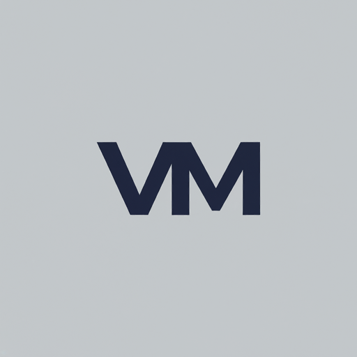

[![Contributors][contributors-shield]][contributors-url]
[![Forks][forks-shield]][forks-url]
[![Stargazers][stars-shield]][stars-url]
[![Issues][issues-shield]][issues-url]

<!-- PROJECT LOGO -->
 

  

  <h3 align="center">Vinayak Multinationals</h3>

  

     
    <a href="https://drive.google.com/file/d/1xYw5Zkr2SXAJZQWvo3kztSyZ1_OIyTmZ/view?usp=share_link">View Demo</a>
    ·
    <a href="https://github.com/d-pamneja/Vinayak_Multinational/issues/new?labels=bug&template=bug-report---.md">Report Bug</a>
    ·
    <a href="https://github.com/d-pamneja/Vinayak_Multinational/issues/new?labels=enhancement&template=feature-request---.md">Request Feature</a>
  

<!-- TABLE OF CONTENTS -->

  
Table of Contents

  <ol>
    <li>
      <a href="#about-the-project">About The Project</a>
      <ul>
        <li><a href="#built-with">Built With</a></li>
      </ul>
    </li>
    <li>
      <a href="#getting-started">Getting Started</a>
      <ul>
        <li><a href="#prerequisites">Prerequisites</a></li>
        <li><a href="#installation">Installation</a></li>
      </ul>
    </li>
    <li><a href="#license">License</a></li>
    <li><a href="#contact">Contact</a></li>
  </ol>

<!-- ABOUT THE PROJECT -->
## About The Project

[![Product Name Screen Shot][product-screenshot]](https://example.com)

Welcome to the digital home of Vinayak Multinationals Pvt. Ltd., where innovation meets tradition. This website serves as a comprehensive platform to showcase the company's diverse business portfolio, commitment to quality, and unwavering focus on customer satisfaction.

### Key Features and Technologies

* Informative and Engaging: The website provides a clear and concise overview of our company, our values, and the industries we serve. It features detailed information about our products, services, and our global presence.
* User-Friendly Navigation: Intuitive navigation and a well-organized structure ensure a seamless browsing experience for visitors.
* Modern Design: A visually appealing and modern design reflects the progressive nature of our company.
* Responsive Layout: The website adapts to different screen sizes, providing optimal viewing on desktops, tablets, and mobile devices.
* Built with Core Web Technologies: The website leverages the power of HTML, CSS, and PHP to deliver a robust and dynamic experience.
* PHP for Dynamic Content: PHP is used to generate dynamic content, ensuring that information is always up-to-date and tailored to the user.
* Contact Form: A convenient contact form allows visitors to easily get in touch with us for inquiries or collaborations.

### Our Approach

This website is a testament to our dedication to excellence. It was meticulously crafted by our team of skilled developers, designers, and content creators, who worked collaboratively to bring our vision to life. We leveraged industry best practices and cutting-edge technologies to create a website that not only showcases our capabilities but also provides a valuable resource for our clients and partners.

We believe that this website will serve as a powerful tool for connecting with our audience, fostering new relationships, and strengthening existing ones. Whether you're a potential client, a valued partner, or simply interested in learning more about our company, we invite you to explore our website and discover the Vinayak Multinationals difference.

### Future Enhancements

We are committed to continuously improving our online presence. In the future, we plan to add more interactive features, expand our content offerings, and incorporate the latest web technologies to provide an even more engaging and informative experience.

Thank you for visiting the Vinayak Multinationals website and resources. We look forward to hearing from you and working with you to achieve your business goals.

Disclaimer: This website is intended for informational purposes only and does not constitute an offer or solicitation for any products or services. Please refer to our terms and conditions for more details.

(<a href="#readme-top">back to top</a>)

### Built With

Below given are the frameworks as well as the languages used in the development of this website:

* [![HTML][HTML5]][HTML-url]
* [![CSS][CSS3]][CSS-url]
* [![JavaScript][JavaScript]][JavaScript-url]
* [![PHP][PHP]][PHP-url]

(<a href="#readme-top">back to top</a>)

<!-- GETTING STARTED -->
## Getting Started
This is the website of Vinayak Multinationals Pvt. Ltd. It has been developed by RDBiz. The website is a static website that can be hosted on any web server. The website is built using HTML, CSS, and JavaScript. The website is responsive and can be viewed on any device.

### Prerequisites

* AMPPS: Ensure you have AMPPS installed and running on your system. You can download it from the official website: https://ampps.com/

### Installation

#### Steps

* Download Website Files:

    * Download the Vinayak Multinationals website files as a ZIP archive from here (https://github.com/d-pamneja/Vinayak_Multinational/archive/refs/heads/main.zip).
    * Extract the contents of the ZIP archive to a temporary location.

* Create a New Domain in AMPPS:

    * Open your AMPPS control panel (usually accessible through http://localhost/ampps/).
    * Navigate to "Add Domain."
    * Enter a domain name (e.g., vinayak.local) or use your computer's IP address.
    * Click "Add Domain."

* Upload Website Files:

    * In the AMPPS control panel, click on the newly created domain to manage it.
    * Click on "File Manager."
    * Navigate to the www directory within your domain's folder.
    * Upload the extracted website files (HTML, CSS, JavaScript, images, etc.) into the www directory.

* Access Your Website:

    * Open a web browser.
    * Enter the domain name you created (e.g., http://vinayak.local) or your computer's IP address.
    * You should now see your Vinayak Multinationals website running on the AMPPS server!

(<a href="#readme-top">back to top</a>)

<!-- LICENSE -->
## License
This repository and its assets are exclusively for the use of Vinayak Multinationals Pvt. Ltd. and RDBiz. No other individual or entity is permitted to use, modify, distribute, or exploit any part of this property, whether for personal, commercial, or any other purposes. Unauthorized use, including but not limited to reproduction, adaptation, or commercial exploitation, is strictly prohibited.

(<a href="#readme-top">back to top</a>)

<!-- CONTACT -->
## Contact
This website has been developed by RDBiz. For any queries or concerns, please contact us at the following email addresses:

- [RDBiz](mailto:rdbiz@gmail.com)
- [Rhythm Arya](mailto:official.rhythmarya@gmail.com)
- [Dhruv Pamneja](mailto:dpamneja@gmail.com)

(<a href="#readme-top">back to top</a>)

<!-- MARKDOWN LINKS & IMAGES -->
<!-- https://www.markdownguide.org/basic-syntax/#reference-style-links -->
[contributors-shield]: https://img.shields.io/github/contributors/d-pamneja/Vinayak_Multinational.svg?style=for-the-badge
[contributors-url]: https://github.com/d-pamneja/Vinayak_Multinational/graphs/contributors
[forks-shield]: https://img.shields.io/github/forks/d-pamneja/Vinayak_Multinational.svg?style=for-the-badge
[forks-url]: https://github.com/d-pamneja/Vinayak_Multinational/network/members
[stars-shield]: https://img.shields.io/github/stars/d-pamneja/Vinayak_Multinational.svg?style=for-the-badge
[stars-url]: https://github.com/d-pamneja/Vinayak_Multinational/stargazers
[issues-shield]: https://img.shields.io/github/issues/d-pamneja/Vinayak_Multinational.svg?style=for-the-badge
[issues-url]: https://github.com/d-pamneja/Vinayak_Multinational/issues
[license-shield]: https://img.shields.io/github/license/d-pamneja/Vinayak_Multinational.svg?style=for-the-badge
[license-url]: https://github.com/d-pamneja/Vinayak_Multinational/blob/master/LICENSE.txt
[linkedin-shield]: https://img.shields.io/badge/-LinkedIn-black.svg?style=for-the-badge&logo=linkedin&colorB=555
[linkedin-url]: https://linkedin.com/in/othneildrew
[product-screenshot]: assets/images/product_screenshot1.png
[HTML5]: https://img.shields.io/badge/HTML5-E34F26?style=for-the-badge&logo=html5&logoColor=white
[HTML-url]: https://developer.mozilla.org/en-US/docs/Web/HTML
[CSS3]: https://img.shields.io/badge/CSS3-1572B6?style=for-the-badge&logo=css3&logoColor=white
[CSS-url]: https://developer.mozilla.org/en-US/docs/Web/CSS
[JavaScript]: https://img.shields.io/badge/JavaScript-F7DF1E?style=for-the-badge&logo=javascript&logoColor=black
[JavaScript-url]: https://developer.mozilla.org/en-US/docs/Web/JavaScript
[Php]: https://img.shields.io/badge/PHP-777BB4?style=for-the-badge&logo=php&logoColor=white
[PHP-url]: https://www.php.net/
[Next.js]: https://img.shields.io/badge/next.js-000000?style=for-the-badge&logo=nextdotjs&logoColor=white
[Next-url]: https://nextjs.org/
[React.js]: https://img.shields.io/badge/React-20232A?style=for-the-badge&logo=react&logoColor=61DAFB
[React-url]: https://reactjs.org/
[Vue.js]: https://img.shields.io/badge/Vue.js-35495E?style=for-the-badge&logo=vuedotjs&logoColor=4FC08D
[Vue-url]: https://vuejs.org/
[Angular.io]: https://img.shields.io/badge/Angular-DD0031?style=for-the-badge&logo=angular&logoColor=white
[Angular-url]: https://angular.io/
[Svelte.dev]: https://img.shields.io/badge/Svelte-4A4A55?style=for-the-badge&logo=svelte&logoColor=FF3E00
[Svelte-url]: https://svelte.dev/
[Laravel.com]: https://img.shields.io/badge/Laravel-FF2D20?style=for-the-badge&logo=laravel&logoColor=white
[Laravel-url]: https://laravel.com
[Bootstrap.com]: https://img.shields.io/badge/Bootstrap-563D7C?style=for-the-badge&logo=bootstrap&logoColor=white
[Bootstrap-url]: https://getbootstrap.com
[JQuery.com]: https://img.shields.io/badge/jQuery-0769AD?style=for-the-badge&logo=jquery&logoColor=white
[JQuery-url]: https://jquery.com 